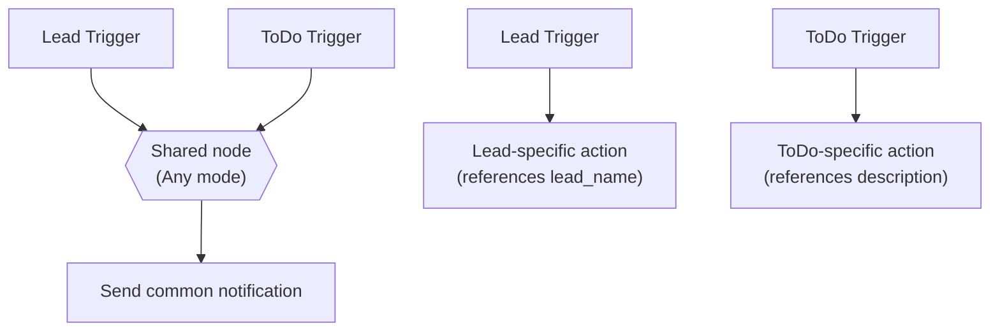

# Triggers, Multi-Trigger, and Cross-Doctype Model

Deep-dive on how automations start, how multiple triggers interact, and how the system
handles the ambiguity that arises when two different doctypes can fire the same automation.

---

## 1. What a Trigger Is

An **Automation** has a child table called `Automation Trigger` (one or more rows). Each row
specifies a **DocType** and a **Frappe hook event**. When a document of that doctype is saved
(submitted, cancelled, etc.), the hook fires and the dispatcher looks for automations whose
trigger rows match.

Multiple trigger rows use **OR semantics** — ANY matching row is sufficient to start a run.

### Real example

```
Automation: "New Lead Follow-up"
  Trigger row 1:  DocType = Lead,      Event = After Insert,  Conditions: lead_source = "Web"
  Trigger row 2:  DocType = ToDo,      Event = On Update,     Conditions: (none)
```

| What happens | Run starts? | Why |
|---|---|---|
| Lead inserted, `lead_source = "Web"` | Yes | Row 1 matches (doctype + event + condition) |
| Lead inserted, `lead_source = "Campaign"` | No | Row 1 matches doctype+event but condition fails; Row 2 doesn't match (wrong doctype) |
| ToDo updated (any) | Yes | Row 2 matches doctype+event, no conditions to block |
| Note inserted | No | No trigger row targets Note/After Insert |

**Important:** all trigger rows are evaluated against the **same document** (the one that
fired the hook). A Lead document is tested against both the Lead row and the ToDo row. The
ToDo row's conditions will typically fail because a Lead doesn't have ToDo fields — this is
expected and harmless.

### How dispatch works (the real path)

1. Frappe's hook system calls `on_doc_event(doc, method)` for every save/submit/cancel site-wide
   (`dispatcher.py:118`)
2. `on_doc_event` maps the method name to an event string via `EVENT_MAP` (`dispatcher.py:19-24`):
   - `after_insert` → `"After Insert"`
   - `on_update` → `"On Update"`
   - `on_submit` → `"On Submit"`
   - `on_cancel` → `"On Cancel"`
3. A SQL query joins `tabAutomation` with `tabAutomation Trigger` to find enabled+published
   automations matching the doctype+event (`dispatcher.py:136-145`)
4. For each match, `_evaluate_trigger_conditions` checks all trigger rows against the document
   (`dispatcher.py:164-202`)
5. If any row matches, `frappe.enqueue("automation_builder.dispatcher.execute_automation", ...)`
   is called (`dispatcher.py:153-159`)

---

## 2. Conditions Within a Trigger Row

Each trigger row can have multiple conditions stored in the **Automation Trigger Condition**
grandchild table. These are combined using the `condition_logic` field on the row:

| `condition_logic` value | Behaviour |
|---|---|
| `"All must match"` (default) | AND — every condition must be true |
| `"Any must match"` | OR — at least one condition must be true |

### Supported operators

Listed from `Automation Trigger Condition` doctype schema (`automation_trigger_condition.json`)
and the evaluation logic in `dispatcher.py:26-112`:

| Operator | Behaviour | Example |
|---|---|---|
| `=` | Exact equality | `status = "Open"` |
| `!=` | Not equal | `status != "Closed"` |
| `>` | Greater than (numeric coercion) | `amount > 100` |
| `<` | Less than (numeric coercion) | `amount < 50` |
| `>=` | Greater than or equal | `priority >= 3` |
| `<=` | Less than or equal | `score <= 10` |
| `like` | Case-insensitive substring match; supports `%` wildcard | `title like "%urgent%"` |
| `not like` | Inverse of like | `name not like "%test%"` |
| `in` | Value is one of comma-separated list | `status in "Open,Pending"` |
| `not in` | Value is NOT in comma-separated list | `priority not in "Low,Very Low"` |
| `is set` | Field is non-null and non-empty | `email_id is set` |
| `is not set` | Field is null or empty | `description is not set` |

When a trigger row has **no conditions** in the grandchild table, the row always matches
(any document of the right doctype+event fires it).

### Legacy path

Trigger rows also have hidden legacy fields (`condition_field`, `condition_operator`,
`condition_value`) for backward compatibility. If the grandchild table is empty, these flat
fields are evaluated instead (`dispatcher.py:197-200`). New automations should use the
grandchild table.

---

## 3. Cross-Doctype Triggers and the Field-Reference Problem

When an automation has triggers on two different doctypes (e.g., Lead + ToDo), a problem
arises in the action nodes downstream: **which doctype's fields should the field picker show?**

A Lead has `lead_name`, `company`, `email_id`. A ToDo has `description`, `assigned_to`. They
share almost no fields. If a single "Update Field" action node tries to reference
`{{trigger.lead_name}}` but the run was triggered by a ToDo, that token resolves to an empty
string — silently producing a broken update.

The system needs a way to either:
- **Scope** an action to a specific doctype (skip it when the wrong doctype fires), or
- **Share** an action across doctypes using only common fields (`name`, `owner`, `creation`)

This is what `trigger_doctype_select` solves.

---

## 4. `trigger_doctype_select` — The Three Modes

Every graph node type (Condition, IF, Switch, Action) carries a `trigger_doctype_select` field with three possible values:

| Value | Behavior |
|---|---|
| **Specific doctype** (e.g. `"Lead"`) | The node operates on the Lead trigger's document. Skips if the run was triggered by a different doctype. |
| **`"any"`** | The node operates on whichever trigger fired. No skip — always executes. |
| **Empty / absent** | The node uses the default behavior (matches the run's trigger doctype). |

This config field appears on **all field-reading action types**: Create Document, Send Email, Update Field, HTTP Request, and Telegram (confirmed in `_SCOPABLE_NODE_TYPES` at `api.py:55`). Condition, IF, and Switch nodes are also scoping-checked in the reachability analysis (`api.py:247-255`) via their own field-inspection logic. The dropdown is **only visible** when the automation has more than one trigger row (`ActionConfigForm.vue:158-160`).

### Mode 1: Specific doctype (e.g., `"Lead"`)

The node **only executes** when that exact doctype fired this run. Any other firing doctype
causes the node to be **SKIPPED** (not failed).

The skip check happens in `_execute_action` (`dispatcher.py:389-400`) **before** the action's
`execute()` function is called — so no side effects occur.

**Log message format** (exact string from `dispatcher.py:396-399`):

```
Action scoped to {scoped_doctype}, this run was triggered by {run_doctype}
```

Example: `"Action scoped to Lead, this run was triggered by ToDo"`

A Skipped step does **not** mark the overall Automation Run as Failed. The run status logic
(`dispatcher.py:311,323`) only counts `"Failed"` — `"Skipped"` is treated as success for the
run's overall status.

### Mode 2: `"Any (whichever triggered)"`

The node always executes regardless of which configured trigger fired. The dropdown value is
the literal string `"any"` (`ActionConfigForm.vue:62`).

When `trigger_doctype_select == "any"`, the field picker in the UI falls back to showing the
**first** trigger doctype's fields as a best-effort guide (`ActionConfigForm.vue:224-225`).
At runtime, `{{trigger.fieldname}}` tokens resolve against whichever document actually
triggered this run.

**Critical behavior:** tokens referencing fields that don't exist on the actual triggering
doctype resolve to an **empty string**, not an error. The `try/except` in `resolve_value`
(`_helpers.py:38-42`) catches the `AttributeError`/`TypeError` and returns `""`.

The hint text shown in the UI (`ActionConfigForm.vue:65-68`):

> Resolves against whichever document triggered this run. Tokens for fields not on that
> doctype resolve to empty string. Use common fields only, or duplicate this node per branch
> when per-doctype logic differs.

### Mode 3: Unset / empty string (default)

When `trigger_doctype_select` is not set (empty string or absent from config), the node
**always executes** — it behaves the same as "Any" mode at runtime.

The difference is in the field picker: with no selection, `loadFields()` uses
`props.triggerDoctype` (the first trigger's doctype) as the field reference
(`ActionConfigForm.vue:226`). With `"any"` explicitly selected, it uses
`props.triggerDoctypes[0]` — functionally the same value but semantically explicit.

**There is no skip behavior when unset.** The skip check in `_execute_action`
(`dispatcher.py:392`) requires `scoped_doctype` to be truthy **and** not `"any"` **and**
not equal to `run_doctype`. An empty string is falsy, so the check short-circuits and the
node executes.

---

## 5. Two Patterns for Shared vs Per-Doctype Logic

### Pattern A — Shared step, common fields only

Use **"Any" mode** and only reference fields you know exist on every configured trigger
doctype. The `name` field exists on every Frappe document, so `{{trigger.name}}` is always
safe.

```
Lead Trigger ──┐
               ├──> Shared Action (Any mode) ──> Send common notification
ToDo Trigger ──┘
```

### Pattern B — Genuinely different logic per doctype

Duplicate the node once per branch instead of trying to share one. Each copy gets its own
`trigger_doctype_select` set to a specific doctype, with doctype-specific field references.

```
Lead Trigger ──> Lead Action (scoped to Lead, references lead_name)
ToDo Trigger ──> ToDo Action (scoped to ToDo, references description)
```

**When to use which:** if the shared node uses only common fields (`name`, `owner`,
`creation`), Pattern A is cleaner. If each doctype needs different field names or different
actions entirely, Pattern B avoids empty-token confusion.



---

## 6. Doctype Branching via IF/Switch + "Triggering Doctype"

### The pseudo-field: `__trigger_doctype__`

The IF, Switch, and Condition nodes include a synthetic field called **"Triggering Doctype"**
(value: `__trigger_doctype__`) in their field pickers, listed under an "Automation" optgroup
alongside real document fields.

This is not a real field on any document. At evaluation time, it resolves to
`context["trigger_doctype"]` — the doctype string of the document that triggered this run
(e.g., `"Lead"`, `"ToDo"`). The underlying data was always available in the execution
context (`dispatcher.py:274`); this feature simply exposes it as a choosable field.

### How it works

The sentinel constant `TRIGGER_DOCTYPE_FIELD = "__trigger_doctype__"` is defined in
`_helpers.py` and imported by `if_condition.py`, `switch_case.py`, and `dispatcher.py`.

**In IF/Switch nodes** (`if_condition.py:58-60`, `switch_case.py:44-46`):
```python
if field == TRIGGER_DOCTYPE_FIELD:
    actual = context.get("trigger_doctype", "")
else:
    actual = doc.get(field) if doc else None
```

**In Condition graph nodes** (`dispatcher.py:60-61`):
```python
if field == TRIGGER_DOCTYPE_FIELD and context is not None:
    actual = context.get("trigger_doctype", "")
else:
    actual = doc.get(field) if doc else None
```

The resolved value (a string like `"Lead"`) is compared against the configured value using
the normal operator — no special handling needed beyond the initial resolution.

### Worked example: IF branching on triggering doctype

```
Automation: "Lead + ToDo Follow-up"
  Triggers: Lead / After Insert, ToDo / After Insert

  Graph:
    trigger ──> IF (__trigger_doctype__ = "Lead")
                   ├─ True ──> Action A (scoped to Lead)
                   └─ False ──> Action B (scoped to ToDo)
```

- **Lead inserted** → `context["trigger_doctype"]` = `"Lead"` → IF evaluates
  `"Lead" = "Lead"` → TRUE → Action A runs
- **ToDo inserted** → `context["trigger_doctype"]` = `"ToDo"` → IF evaluates
  `"ToDo" = "Lead"` → FALSE → Action B runs

### Worked example: Switch branching for 3+ doctypes

```
Automation: "Multi-doctype router"
  Triggers: Lead / After Insert, ToDo / After Insert, Note / After Insert

  Graph:
    trigger ──> Switch (__trigger_doctype__)
                   ├─ case-0 ("Lead") ──> Lead-specific action
                   ├─ case-1 ("ToDo") ──> ToDo-specific action
                   └─ default ──> Generic action (Note or unknown)
```

Switch is the more natural fit when you have 3+ trigger doctypes and want one branch each.

### Historical workaround (pre-Stage 23)

Before this feature existed, the only way to branch by doctype was to check for a field
that exists on one doctype but not the other:

```
IF: lead_name is set  →  True: Lead path, False: ToDo path
```

This worked but was fragile and unclear. The `__trigger_doctype__` pseudo-field is the
clean solution.

---

## 7. Full Worked Example, End to End

### Setup

```
Automation: "Lead + ToDo Follow-up"
  Status: Published
  Triggers:
    Row 1: Lead / After Insert / Conditions: lead_source = "Web"
    Row 2: ToDo / After Insert / Conditions: (none)

  Graph:
    trigger ──> IF (__trigger_doctype__ = "Lead")
                   ├─ True ──> Update Field (scoped to Lead)
                   │             target: Same Document
                   │             field: status = "Contacted"
                   └─ False ──> Update Field (scoped to ToDo)
                                  target: Same Document
                                  field: description = "Auto follow-up"
```

### Case 1: Lead inserted with `lead_source = "Web"`

1. Frappe calls `on_doc_event(lead, "after_insert")`
2. Dispatcher query finds the automation (Lead/After Insert matches)
3. `_evaluate_trigger_conditions`: Row 1 conditions (`lead_source = "Web"`) → **TRUE**. Row 2
   evaluated against the Lead (ToDo fields don't exist) → **FALSE**. Overall: **TRUE**.
4. `frappe.enqueue(execute_automation, ...)`
5. Graph walk starts at trigger node
6. IF node: `__trigger_doctype__` → `"Lead"` (from `context["trigger_doctype"]`) →
   `"Lead" = "Lead"` → **TRUE** → follows `if-true` edge
7. Update Field action: `trigger_doctype_select = "Lead"`, `ref_doctype = "Lead"` → match,
   executes. Sets `status = "Contacted"` on the Lead.
8. Run status: **Success**. Log: `[{"step_type": "if", "status": "Success", ...}, {"step_type": "update_field", "status": "Success", ...}]`

### Case 2: ToDo inserted (any description)

1. Frappe calls `on_doc_event(todo, "after_insert")`
2. Dispatcher query finds the automation (ToDo/After Insert matches)
3. `_evaluate_trigger_conditions`: Row 1 (Lead/After Insert) — the query matches on
   doctype+event, but the Lead conditions are evaluated against the ToDo → **FALSE**. Row 2
   (ToDo/After Insert, no conditions) → **TRUE**. Overall: **TRUE**.
4. `frappe.enqueue(execute_automation, ...)`
5. Graph walk starts at trigger node
6. IF node: `__trigger_doctype__` → `"ToDo"` (from `context["trigger_doctype"]`) →
   `"ToDo" = "Lead"` → **FALSE** → follows `if-false` edge
7. Update Field action: `trigger_doctype_select = "ToDo"`, `ref_doctype = "ToDo"` → match,
   executes. Sets `description = "Auto follow-up"` on the ToDo.
8. Run status: **Success**. Log: `[{"step_type": "if", "status": "Success", ...}, {"step_type": "update_field", "status": "Success", ...}]`

### Case 3: Lead inserted with `lead_source = "Campaign"`

1. Dispatcher finds the automation (Lead/After Insert matches)
2. `_evaluate_trigger_conditions`: Row 1 conditions (`lead_source = "Web"`) → **FALSE**
   (actual is "Campaign"). Row 2 evaluated against Lead → **FALSE**. Overall: **FALSE**.
3. Automation is NOT enqueued. No run is created.

### Run History would show

For Case 1:
| Step | Type | Status | Output |
|---|---|---|---|
| 1 | if | Success | `IF __trigger_doctype__ = 'Lead' -> TRUE (actual: 'Lead')` |
| 2 | update_field | Success | `Updated Lead L-00001: status` |

For Case 2:
| Step | Type | Status | Output |
|---|---|---|---|
| 1 | if | Success | `IF __trigger_doctype__ = 'Lead' -> FALSE (actual: 'ToDo')` |
| 2 | update_field | Success | `Updated ToDo TD-00001: description` |

---

## 8. Multiple Trigger Nodes — Canonical Design (Stage 29)

> **Retired**: The Stage 26 tagged-edge system (`applies_to_triggers` on edges, canvas
> edge picker dialog) has been removed entirely. Multiple Trigger nodes on the canvas
> is now the sole canonical design for multi-trigger automations.

### The problem

Before Stage 26, the Trigger node could only have **one** outgoing edge (linear-only
enforced by the canvas). All trigger rows shared the same downstream path. The save-time
validation used a **blanket doctype-count** check: if the automation had 2+ distinct trigger
doctypes anywhere, every field-reading node had to have explicit `trigger_doctype_select`
set — even nodes on separate branches that were only reachable from one doctype.

Stage 26 introduced tagged edges (`applies_to_triggers` on edges) + a canvas edge picker
to route paths by trigger row index. This added complexity but still required a single
Trigger node on canvas.

### The solution: one Trigger node per trigger row

Each trigger row in the child table maps to its **own Trigger node** on the canvas.
A `graph_node_id` field on the `Automation Trigger` child table links each row to its
canvas node. No tagging, no picker dialog — each Trigger node has exactly one outgoing edge.

### Data model

**Trigger node** (canvas):
```json
{ "id": "trigger-lead", "type": "trigger", "position": {"x": 250, "y": 50},
  "data": { "trigger_doctype": "Lead", "trigger_event": "On Update" } }
```

**Edge** (canvas):
```json
{ "id": "e-trigger-lead-cond-lead", "source": "trigger-lead", "target": "cond-lead",
  "sourceHandle": "trigger-lead-out", "targetHandle": "cond-lead-in", "type": "smoothstep" }
```

**Trigger row** (child table):
```json
{ "trigger_type": "DocType Event", "trigger_doctype": "Lead", "trigger_event": "On Update",
  "condition_logic": "All must match", "conditions": [], "graph_node_id": "trigger-lead" }
```

The `graph_node_id` field is what links the trigger row to its canvas Trigger node.

### How dispatch works

In `dispatcher.py:_find_start_trigger(available_trigger_nodes, trigger_doctype, context, automation)`:

1. If `automation` is provided, iterate its `triggers` child table
2. For each row where `trigger_doctype == trigger_doctype`, look up `graph_node_id`
3. If `graph_node_id` matches an available Trigger node ID → return it (primary path)
4. Fallback: match by `trigger_doctype` against the Trigger node's `data.trigger_doctype`
5. Return the first match, or `None` if no trigger matches

This replaces the old `firing_trigger_name` + tagged-edge filtering.

In `dispatcher.py:_walk_graph`:

1. `_find_start_trigger` returns the starting node ID
2. Walk follows edges forward from that Trigger node — no tagged-edge filtering
3. Each Trigger node has one outgoing edge → only its own path is walked
4. Convergence is handled by multiple edges targeting the same node (via different handles)

### How convergence works

Multiple Trigger nodes can converge into a shared Action node. The Action node needs
two input handles: `act-shared-in` (left) and `act-shared-in-right` (right). Each Trigger
path targets a different handle:

```
trigger-lead ──> cond-lead ──> act-shared  (left handle)
trigger-todo ──> cond-todo ──> act-shared  (right handle)
```

The walker checks incoming handles to avoid re-visiting already-visited nodes. When a
node has incoming from multiple Trigger paths, only the first path to reach it executes it.

### How scoping validation works

The validation in `api.py:_validate_scoping_for_multi_doctype`:

1. For each trigger row, find its Trigger node by `graph_node_id` (primary) or
   `trigger_doctype` (fallback)
2. Forward-walk from each Trigger node through edges to find reachable nodes
3. For each reachable Action/Condition/IF/Switch node, check if it has explicit
   `trigger_doctype_select` set
4. If a node is reachable from Trigger nodes of **2+ distinct doctypes** AND
   `trigger_doctype_select` is empty → reject
5. If reachable from only one doctype, or `trigger_doctype_select` is set → pass

### Worked example: user's exact scenario

```
Automation: "Lead + ToDo Follow-up"
  Triggers: Lead / On Update, ToDo / On Update

  Graph:
    trigger-lead ──> Condition(status=Open) ──┐
                                              ├──> Create Document (scoped: any)
    trigger-todo ──> Condition(status=Open) ──┘
```

- **Lead updated**: `_find_start_trigger("Lead")` returns `"trigger-lead"`. Walk follows
  `trigger-lead` → cond-lead → act-shared. Note created.
- **ToDo updated**: `_find_start_trigger("ToDo")` returns `"trigger-todo"`. Walk follows
  `trigger-todo` → cond-todo → act-shared. Note created.
- **Scoping**: act-shared is reachable from both Lead and ToDo → `trigger_doctype_select`
  must be set to `"any"` → validation passes.

### Convergence UX (frontend)

When connecting a new edge to a target node that already has an incoming edge, the
frontend automatically assigns the target handle to `target-in-right` (or `target-in-left`
as fallback). This ensures both edges can connect without manual handle selection.

### Migration notes

- Old automations with `applies_to_triggers` on edges: those fields are ignored.
  The walker no longer reads `applies_to_triggers`. Edges are followed unconditionally.
- The `graph_node_id` column on `tabAutomation Trigger` was added in Stage 29.
  Existing rows have `NULL` for this field — the fallback path matches by `trigger_doctype`.
- Old automations with a single Trigger node continue to work unchanged.
- The canvas edge picker dialog and all its code have been removed from the frontend.

---

## 9. Testing Notes & Honest Gaps

### Why full-path tests matter

The Stage 22 follow-up discovered that skip-detection logic for `trigger_doctype_select`
was reported as "built and tested" but actually did not exist — the tests were calling
`execute_automation()` directly, bypassing `on_doc_event()` and the SQL dispatch query. A
regression in the dispatch path would have gone undetected.

### What IS covered by a full-path test

| Test name | What it exercises |
|---|---|
| `test_full_path_skip_via_on_doc_event` | `doc.insert()` → `on_doc_event()` → SQL dispatch query → `frappe.enqueue` (patched sync) → `execute_automation()` → graph walk → `_execute_action` skip check. Tests both the ToDo (skips) and Lead (executes) branches. |
| `test_if_trigger_doctype_branch` | Same full path through IF node with `__trigger_doctype__` pseudo-field. Lead insert → IF TRUE → lead action. ToDo insert → IF FALSE → todo action. |
| `test_switch_trigger_doctype_branch` | Same full path through Switch node with `__trigger_doctype__`. Lead → case-0. ToDo → case-1. Note → default. |

### What is covered by narrower/unit-level tests

| Test name | Level | What it covers |
|---|---|---|
| `test_specific_doctype_skips_on_wrong_trigger` | Direct call to `execute_automation()` | Skip logic inside `_execute_action` — confirms Skipped status and message format. Does NOT test dispatch path. |
| `test_any_mode_resolves_common_field_and_empty_for_missing` | Direct call + `resolve_value()` | Token resolution with "any" mode — confirms common fields resolve and missing fields resolve to empty string. |
| `test_any_mode_node_executes_not_skips` | Direct call to `execute_automation()` | "Any" mode never skips — confirms node executes for both Lead and Note triggers. |
| `test_trigger_token_resolves_against_triggering_doc` | Unit test of `resolve_value()` | `{{trigger.fieldname}}` token substitution. |
| `test_trigger_doctype_hint_in_context` | Direct call to `execute_automation()` | Context includes `trigger_doctype` key. |

### What is NOT covered

- **Dispatch path for "Any" mode**: no full-path test inserts a document and verifies the
  "Any"-mode action executes via `on_doc_event()`.
- **Frontend rendering**: no automated test verifies the `trigger_doctype_select` dropdown
  renders, the "Any" hint text appears, or the field picker updates when the selection
  changes. (No display server available for browser testing.)

### What was covered in Stage 23.5

- **Multiple trigger rows with conditions**: `test_trigger_conditions_evaluate_independently`
  creates Lead + ToDo triggers with different conditions and verifies each evaluates
  independently (Lead trigger checks status=Open, ToDo trigger checks status=Closed).
- **Condition node with `trigger_doctype_select`**: `test_condition_node_scoped_skips_on_wrong_trigger`
  full-path test exercises the Condition node skip branch.
- **Save-time validation**: `TestMultiDoctypeSaveValidation` tests reject unscoped actions,
  unscoped conditions, and allow scoped nodes with "any" mode. **Note:** the original
  validation used a blanket doctype-count check. Stage 26 replaced this with
  reachability-based analysis (see Section 8). The test_graphs with edges from both
  triggers to the same action still correctly reject; graphs where nodes are reachable
  from only one trigger row now correctly pass.
- **`_evaluate_trigger_conditions` doctype filter**: fixed to only evaluate trigger rows
  matching the document's doctype, preventing false matches across doctypes.

### Where to be skeptical

Any claim about the cross-doctype model that was verified **only** via direct calls to
`execute_automation()` or `resolve_value()` should be treated as partially verified — the
dispatch path (the SQL query in `on_doc_event`, the `frappe.enqueue` handoff) is a separate
code path that could regress independently.
